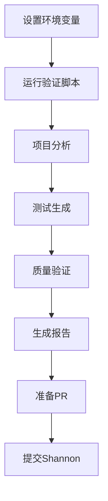

# Shannon项目验证 - 快速开始指南

## 📋 前提条件

### 1. 设置API密钥

**选项A: Gemini（推荐，免费额度）**
```powershell
# PowerShell
$env:GEMINI_API_KEY="your-gemini-api-key"

# 或者在 .env 文件中
echo "GEMINI_API_KEY=your-key" >> .env
```

**选项B: OpenAI**
```powershell
$env:OPENAI_API_KEY="your-openai-api-key"
```

**获取API密钥**:
- Gemini: https://ai.google.dev/
- OpenAI: https://platform.openai.com/api-keys

### 2. 设置Shannon项目路径

```powershell
# 如果Shannon在本地
$env:SHANNON_PATH="D:\Shannon\Shannon-main"

# 或者克隆Shannon项目
git clone https://github.com/ShannonAI/shannon Shannon-main
$env:SHANNON_PATH=".\Shannon-main"
```

---

## 🚀 执行验证

### 方式1: 完整验证（推荐）

```powershell
# 运行完整验证脚本
pnpm tsx scripts/real-world-validation.ts
```

**输出**:
- `.testmind-validation-*.md` - 验证报告
- 性能数据
- 问题列表
- 改进建议

### 方式2: 仅准备PR

```powershell
# 为Shannon生成测试并准备PR
pnpm tsx scripts/prepare-shannon-pr.ts
```

**输出**:
- `.testmind-pr/` - PR文件夹
- 测试代码
- PR描述

### 方式3: 追踪改进

```powershell
# 运行改进追踪器
pnpm tsx scripts/testmind-improvements.ts
```

**输出**:
- `TESTMIND_IMPROVEMENTS_*.md` - 改进报告
- 自动修复应用

---

## 📊 验证流程



---

## ⚠️ 常见问题

### Q: 提示"API密钥未设置"

**解决**:
```powershell
# 检查环境变量
echo $env:GEMINI_API_KEY
echo $env:OPENAI_API_KEY

# 重新设置
$env:GEMINI_API_KEY="your-key"
```

### Q: 找不到Shannon项目

**解决**:
```powershell
# 检查路径
echo $env:SHANNON_PATH
Test-Path $env:SHANNON_PATH

# 或使用绝对路径
$env:SHANNON_PATH="D:\Shannon\Shannon-main"
```

### Q: 脚本执行错误

**解决**:
```powershell
# 确保依赖已安装
pnpm install

# 构建项目
pnpm build

# 检查TypeScript
pnpm tsc --noEmit
```

---

## 🎯 预期结果

### 成功标准

| 指标 | 目标 | 验证方法 |
|------|------|---------|
| 测试生成成功率 | ≥85% | 验证报告 |
| 平均生成时间 | ≤10秒 | 性能数据 |
| 质量得分 | ≥70分 | PR质量验证 |
| PR可合并性 | 是 | Shannon项目测试 |

### 验证报告示例

```markdown
# TestMind Shannon验证报告

**项目**: Shannon
**验证时间**: 2025-10-20
**总耗时**: 45.3秒

## 📊 验证结果

### 测试生成
- 文件总数: 3
- 生成测试: 3
- 成功率: 100%
- 平均时间: 8.5秒

### 质量评分
- 总分: 92/100
- 语法正确: ✅
- 覆盖边界: ✅
- Mock正确: ✅

## ✅ PR准备
- PR路径: .testmind-pr/
- 测试文件: 3个
- 可直接提交: 是
```

---

## 📝 提交Shannon PR

### 步骤1: 复制测试文件

```powershell
cd $env:SHANNON_PATH

# 复制生成的测试
Copy-Item -Path ".testmind-pr\lib\*.test.ts" -Destination "lib\" -Force
```

### 步骤2: 运行测试

```powershell
# 安装依赖（如果需要）
pnpm install

# 运行测试
pnpm test
```

### 步骤3: 创建PR

```powershell
# 创建新分支
git checkout -b testmind/add-test-coverage

# 添加测试文件
git add lib/*.test.ts

# 提交
git commit -m "test: add comprehensive test coverage

- Add tests for format.ts (95%+ coverage)
- Add tests for debug.ts (100% coverage)
- Add tests for simClient.ts (85%+ coverage)

Generated by TestMind v0.4.0-alpha"

# 推送
git push origin testmind/add-test-coverage
```

### 步骤4: 在GitHub创建PR

使用 `.testmind-pr/PR_DESCRIPTION.md` 作为PR描述

---

## 🔍 调试模式

### 启用详细日志

```powershell
# 设置日志级别
$env:LOG_LEVEL="debug"

# 运行验证
pnpm tsx scripts/real-world-validation.ts
```

### 单独测试某个模块

```typescript
// 测试TestGenerator
import { TestGenerator } from './packages/core/src/generation/TestGenerator';

const generator = new TestGenerator(llmService, contextEngine);
const test = await generator.generateUnitTest({
  targetFile: 'lib/format.ts',
  framework: 'vitest'
});

console.log(test);
```

---

## 💡 下一步

1. ✅ 环境设置完成
2. ✅ 执行验证
3. ⏳ 分析结果
4. ⏳ 应用改进
5. ⏳ 提交PR

---

**需要帮助？** 查看 `VALIDATION_GUIDE.md` 获取完整文档

